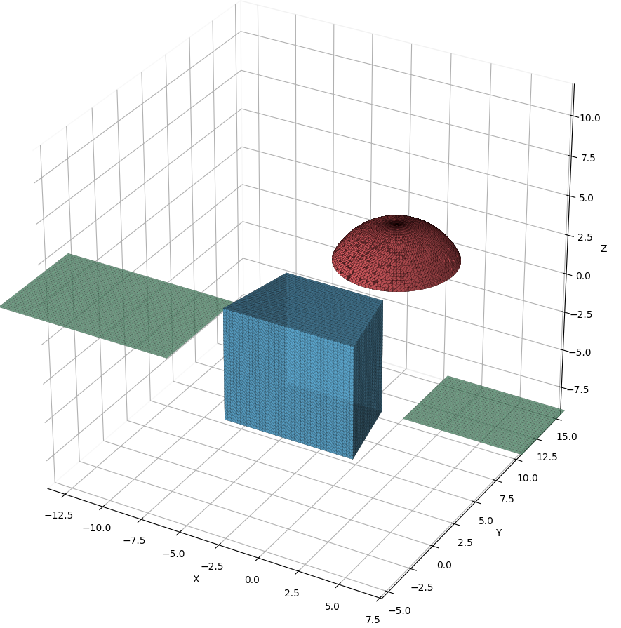
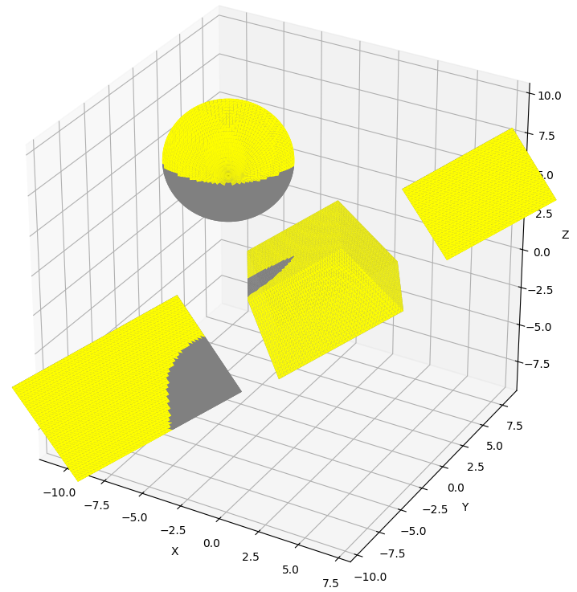
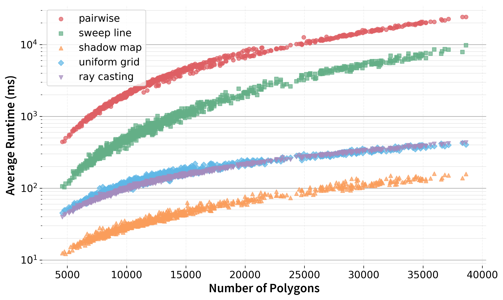

# 🛰️ Comparative Analysis of Spacecraft Self-Shadowing Algorithms

<div align="center">


[](https://isocpp.org/)
[](https://www.python.org/)
[](LICENSE)

**The effects of self-shadowing for spacecraft models should be accounted. This comparative analysis promotes general-purpose tools for SRP self-shadow modeling, suitable for real-time applications.**

[Features](#-features) • [Algorithms](#-algorithms) • [Dataset](#-dataset-generation) • [Installation](#-installation) • [Usage](#-usage) • [Results](#-results) • [Citation](#-citation)

</div>

---

## 📋 Overview

Self-shadowing effects significantly impact Solar Radiation Pressure (SRP) modeling for spacecraft, particularly in high-precision orbit determination and attitude dynamics. This project provides:

- 🔬 **Comprehensive benchmark** of 5 different self-shadowing algorithms
- 🎯 **Open-source implementations** optimized for real-time applications
- 📊 **Synthetic dataset generation** tools for spacecraft geometries
- 📈 **Performance analysis** with accuracy vs. speed trade-offs
- 🛠️ **Production-ready code** in C++ with Python visualization tools

<div align="center">

### Example Spacecraft Model

 

*Left: Generated spacecraft geometry. Right: Self-shadowing analysis (green = sunlit, red = shadowed)*

</div>

---

## ✨ Features

### 🚀 Algorithm Implementations (`SatSelf-Shadow`)

Five self-shadowing algorithms adapted from computer graphics for spacecraft SRP modeling, benchmarked across 1000 synthetic spacecraft models

### 🛰️ Dataset Generation (`SatForm`)

- **Parametric spacecraft generation** with configurable components
- **Realistic geometries**: body, solar panels, antennae
- **Automatic triangulation** and mesh export
- **CSV format** with triangle vertices and normals
- **Randomized configurations** for diverse training data
- **High-precision output** (double precision floating-point)

### 📊 Benchmarking & Visualization

- Automated performance testing across multiple datasets
- Accuracy metrics (precision, recall, F1-score)
- Execution time measurements with scaling analysis
- 3D visualization with Python/Matplotlib
- Export to CSV for further analysis

<div align="center">

### Performance Scaling



*Computational time scaling with polygon count for all implemented algorithms*

</div>

---

## 🏗️ Project Structure

```
Comparative-Analysis-Spacecraft-Self-Shadowing/
│
├── SatSelf-Shadow/                # Self-shadowing algorithms implementation
│   ├── ShadowAlgorithms.h        # Algorithm interfaces
│   ├── ShadowAlgorithms.cpp      # Core algorithm implementations
│   ├── main.cpp                  # Main benchmark driver
│   ├── SatelliteDataset.h        # Dataset loader
│   └── visualize3d.py            # 3D visualization tools
│
├── SatForm/                       # Spacecraft dataset generator
│   ├── CLASS_Spacecraft.h        # Spacecraft model class
│   ├── CLASS_SpacecraftPart.h    # Component definitions
│   ├── CLASS_Shape.h             # Geometric primitives
│   ├── main.cpp                  # Main generator
│   └── visualize3d.py            # Dataset visualization
│
├── Model_ex1.png                  # Example spacecraft model
├── Model_ex1_post.png             # Example self-shadowing analysis
├── time_vs_polygons_log.png       # Performance scaling graph
└── README.md                      # This file
```

---

## 🔧 Installation

### Prerequisites

```bash
# C++ Compiler with C++17 support
- MSVC (Visual Studio 2019+) / GCC 7+ / Clang 5+
- CMake 3.15+ (optional)

# Python dependencies
- Python 3.8+
- numpy
- matplotlib
- pandas
```

### Python Setup
```bash
pip install numpy matplotlib pandas
```

---

## 🚀 Usage

### 1. Generate Spacecraft Dataset

```bash
cd SatForm
# Compile and run the generator

# Generates parameterized spacecraft models
# Output: data3d_<scale>/<model_id>.csv
```

**Configuration:** Edit `main.cpp` to adjust:
- Spacecraft scale factor
- Number of models
- Component probabilities
- Geometric parameters

### 2. Run Self-Shadowing Benchmarks

```bash
cd SatSelf-Shadow
# Compile and run the benchmark

# Runs all algorithms on generated datasets
# Outputs benchmark_results_*.csv with timing and accuracy metrics
```

---

## 📊 Key Findings

This study presents a comprehensive benchmark of self-shadowing algorithms adapted from computer graphics for accurate SRP modeling in spacecraft dynamics. Evaluating five methods across a synthetic dataset of 1000 spacecraft models demonstrates significant variations in computational efficiency and accuracy:

✅ **Ray Casting with BVH** emerged as the most robust approach, achieving perfect accuracy with linear scaling and runtimes suitable for precise orbit determination and attitude control

✅ **Shadow Mapping** offers the highest speed at acceptable accuracy levels (95-97%), making it ideal for real-time or resource-constrained scenarios

✅ **Systematic comparison** across multiple methods and diverse configurations promotes general-purpose, integrable solutions for numerical propagators

### Future Directions

- **Enhanced geometries**: Integration with detailed CAD models of real spacecraft beyond primitive shapes
- **Multiple reflections**: Extension to incorporate ray reflections for improved fidelity with reflective surfaces
- **Parallelization**: CPU/GPU implementation for handling ultra-high-fidelity models in real-time applications
- **Mission integration**: Deployment in operational orbit determination and attitude control systems


---

## 🔬 Research Applications

This project enables:

1. **Orbit Determination** - Accurate SRP modeling improves orbit prediction
2. **Attitude Dynamics** - Self-shadowing affects torque calculations
3. **Thermal Analysis** - Shadow patterns determine temperature distribution
4. **Mission Planning** - Power availability estimates for solar-powered spacecraft
5. **Real-time Simulation** - Fast algorithms enable hardware-in-the-loop testing

---

## 🛠️ Development

### Adding New Algorithms

Implement the following interface in `ShadowAlgorithms.cpp`:

```cpp
std::vector<int> calculate_labels_your_algorithm(
    const std::vector<Triangle>& triangles,
    const std::vector<double>& sun_vector
) {
    // Return vector of labels: 1 = sunlit, 0 = shadowed
}
```

---

## 📚 Citation

If you use this code in your research, please cite:

```bibtex
@software{spacecraft_shadow_analysis2025,
  title={Comparative Analysis of Spacecraft Self-Shadowing Algorithms},
  author={Your Name},
  year={2025},
  url={https://github.com/yourusername/Comparative-Analysis-Spacecraft-Self-Shadowing},
  note={Open-source implementations for SRP self-shadow modeling}
}
```

---

## 📄 License

This project is licensed under the MIT License - see the [LICENSE](LICENSE) file for details.

---

## 🤝 Contributing

Contributions are welcome! Please feel free to:

- 🐛 Report bugs
- 💡 Suggest new algorithms
- 📖 Improve documentation
- ⭐ Star this repository if you find it useful!

### Development Guidelines

1. Fork the repository
2. Create a feature branch (`git checkout -b feature/amazing-algorithm`)
3. Commit your changes (`git commit -m 'Add amazing algorithm'`)
4. Push to the branch (`git push origin feature/amazing-algorithm`)
5. Open a Pull Request

---

## 🙏 Acknowledgments

- Research conducted at [Your Institution]
- Inspired by real-world challenges in spacecraft dynamics
- Built with modern C++ and Python tools

---

## 📞 Contact

- **Author:** Your Name
- **Email:** your.email@example.com
- **Institution:** Your Research Institution
- **Project Link:** [GitHub Repository](https://github.com/yourusername/Comparative-Analysis-Spacecraft-Self-Shadowing)

---

<div align="center">

**Made with ❤️ for the spacecraft dynamics community**

⭐ Star this repository to support open-source space research! ⭐

</div>
